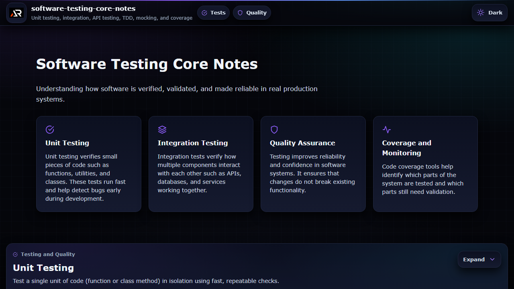

# Software Testing Core Notes

A focused React reference for revising practical software testing concepts, from unit tests and integration testing to API testing, TDD, mocking, and code coverage.

## Features

- Topic sections for unit, integration, API, and test-driven development
- Notes on mocking, coverage, and practical quality checks
- Dark and light themes with local preference storage
- Responsive layout with a floating go-to-top control
- Local assets and GitHub Pages deployment

## Tech stack

React, Vite, styled-components, and React Icons.

## Run locally

~~~
npm install
npm run dev
~~~

## Deployment

Live site: [a2rp.github.io/software-testing-core-notes](https://a2rp.github.io/software-testing-core-notes/)

Build and deploy:

~~~
npm run lint
npm run build
npm run deploy
~~~

## Screenshot

## Links

- [Portfolio](https://www.ashishranjan.net/)
- [GitHub](https://github.com/a2rp)
- [CodePen](https://codepen.io/ash1198)
- [LinkedIn](https://www.linkedin.com/in/aashishranjan)
- [Facebook](https://www.facebook.com/theash.ashish/)
- [YouTube](https://www.youtube.com/@ashishranjan-ashz?sub_confirmation=1)
- [Email](mailto:ash.ranjan09@gmail.com)

## Support

- [Support](https://a2rp-donation-page.netlify.app/)
- [Buy Me a Coffee](https://buymeacoffee.com/a2rp)
- [Patreon](https://patreon.com/a2rp)