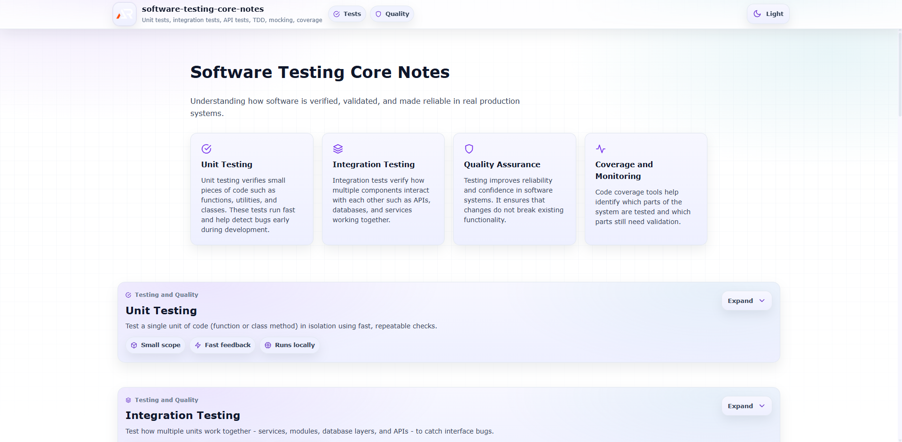

# Software Testing Core Notes

A structured collection of practical notes covering the foundations of software testing and quality engineering.

This repository focuses on the core ideas used in modern software development to verify correctness, reliability, and maintainability of applications.

The goal is to explain testing concepts in a simple and practical way so developers can understand not only how testing works but also why it matters in real production systems.

---

---

## Topics Covered

- Unit Testing
- Integration Testing
- API Testing
- Test Driven Development (TDD)
- Mocking and Test Doubles
- Code Coverage

Each topic explains the concepts, terminology, and practical examples used in modern software engineering.

---

## Why Software Testing Matters

Testing helps developers detect bugs early, improve code quality, and ensure that systems behave correctly even as the codebase grows.

Benefits of testing include:

- Early bug detection
- Safer refactoring
- Improved reliability
- Better developer confidence
- More maintainable code

Modern development workflows depend heavily on automated tests to maintain stability during continuous development.

---

## Key Testing Levels

### Unit Testing

Tests small pieces of code such as individual functions or classes.

Example:
Testing a function that calculates the total price of items in a shopping cart.

---

### Integration Testing

Tests how multiple components work together.

Example:
Testing if the user registration system correctly stores data in the database.

---

### API Testing

Tests backend endpoints to ensure correct request and response behavior.

Example:
Verifying that a login API returns the correct authentication token.

---

### Test Driven Development (TDD)

A development workflow where tests are written before the actual implementation.

Typical cycle:

1. Write a failing test
2. Implement minimal code to pass the test
3. Refactor the code

---

### Mocking

Mocking replaces real dependencies with simulated objects during testing.

Example:
Replacing a real database with a mock database during unit tests.

---

### Code Coverage

Code coverage measures how much of the codebase is executed during tests.

Common coverage metrics include:

- Line coverage
- Function coverage
- Branch coverage

Higher coverage does not guarantee bug-free code, but it helps identify untested areas.

---

## Technologies Used

- React
- Vite
- Styled Components
- React Icons

These tools are used to build interactive documentation and expandable concept explanations.

---

## Repository Purpose

This repository is part of a larger collection of engineering notes that explain important computer science and software engineering topics.

The aim is to create a clear and accessible reference for developers learning system design, backend engineering, and production-grade software practices.

---

## Related Repositories

Other repositories in the Core Notes series include:

- Operating Systems Core Notes
- Computer Networks Core Notes
- Backend Engineering Core Notes
- DevOps and Cloud Core Notes
- Databases Core Notes

Together these repositories form a structured knowledge base for modern software engineering.

---

## Follow Me

---

- GitHub: https://www.github.com/a2rp
- Portfolio: https://www.ashishranjan.net
- LinkedIn: https://www.linkedin.com/in/aashishranjan
- Facebook: https://www.facebook.com/theash.ashish/
- Youtube: https://www.youtube.com/@ashishranjan-ashz
